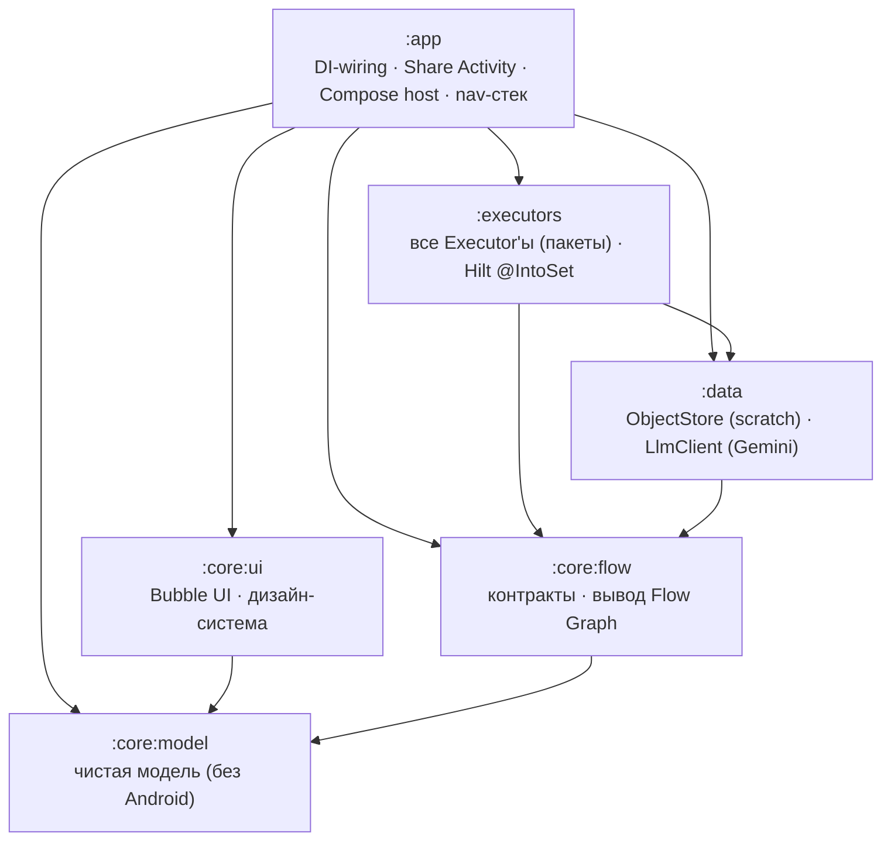
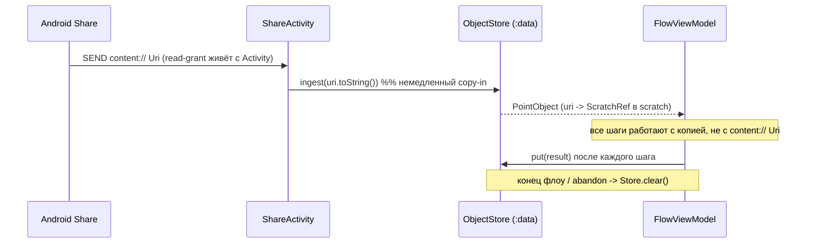

# Point v0.2 — Архитектура

Проектный документ, подготовленный по ТЗ (`../point-v0.2-spec.md`) **до** написания
кода реализации. Здесь — модули, границы, вывод Flow Graph, жизненный цикл
объекта, последовательность экранов и список Executor'ов.

Идея приложения: путешествие по **состояниям объекта**, а не по приложениям. Весь
UI — пузырьки действий вокруг объекта. Никаких списков функций, меню, настроек,
чатов.

---

## Модули и направление зависимостей



**Правило зависимостей (строгое):** стрелки идут только вниз. `:core:model` не
зависит ни от чего; `:core:flow` — только от `:core:model`. Ни один модуль не
зависит от `:app`. Реализации side-effect'ов (`:data`, `:executors`) зависят от
контрактов (`:core:flow`), но не наоборот.

| Модуль | Тип | Android API? | Роль |
|---|---|---|---|
| `:core:model` | kotlin-jvm | **нет** | Модель, состояния, результаты. |
| `:core:flow` | kotlin-jvm | **нет** | Контракты Executor/Registry/Store/Llm, вывод графа. |
| `:core:ui` | android-lib | да (Compose) | Пузырьки, дизайн-система. Ноль бизнес-логики. |
| `:data` | android-lib | да | Scratch-store, copy-in, cleanup; Gemini-клиент. |
| `:executors` | android-lib | да | Все Executor'ы; регистрируются через Hilt multibinding. |
| `:app` | android-app | да | Share Activity, Compose host, стек-навигация, DI-wiring. |

---

## Flow Graph выводится, а не хранится

Отдельной таблицы переходов нет. Каждый `Executor` декларирует контракт входа
(`accepts(state)`) и выхода (`produces(state)`). Пузырьки для текущего состояния —
это ровно те Executor'ы, у кого `accepts(state) == true`:

```
bubblesFor(state) = registry.executors.filter { it.accepts(state) }.map { it.toBubble() }
```

Добавили Executor → граф расширился. Убрали → сузился. UI и карта переходов не
могут рассинхронизироваться, потому что карты нет.

---

## Состояние объекта = тип + дешёвые признаки

`ObjectState(kind: ObjectKind, features: Set<Feature>)`.

- `kind` — по MIME, мгновенно (нулевые сигналы).
- `features` — дёшево вычисляемые сигналы (`HAS_TEXT`, `IS_IMAGE_PDF`,
  `ZIP_OF_IMAGES`, `HAS_URL`, `LARGE`).

Богатство состояния определяет качество первого экрана: только MIME → пузырьки
generic; есть признаки → пузырьки умные. Признаки добавляются **прогрессивно**
(см. ниже).

---

## Первый экран и латентность

1. **Первая отрисовка ≤ 300 мс** — только по нулевым сигналам (MIME / расширение /
   размер). Никакого I/O. → базовый набор пузырьков.
2. **Async-обогащение** — заглянуть внутрь PDF/ZIP, детект `HAS_TEXT` — идёт в
   фоне и *дополняет*/уточняет пузырьки позже (progressive disclosure). Иначе
   200-МБ ZIP ломает обещание 300 мс.
3. **LLM не на первом экране.** Gemini вызывается только после выбора действия,
   внутри `AiExecutor`.

---

## Жизненный цикл объекта (scratch-store)



**Почему copy-in немедленный:** временный read-grant на `content://` Uri привязан
к жизни принимающей Activity. Наивная передача Uri в корутину/ViewModel падает
при пересоздании Activity. Копия в приватном scratch снимает эту грабли; по
завершении флоу scratch чистится.

---

## Навигация — стек состояний

- Флоу = стек `FlowFrame(state, object, bubbles)` внутри одной ViewModel.
- Compose рендерит **верхний** фрейм.
- Системный Back = pop фрейма; выход из приложения — только при пустом стеке.
- Process death в середине флоу (MVP): флоу теряется, но `ObjectStore.clear()`
  обязателен. Персист стека — за рамками MVP.

---

## Результат Executor'а — явный канал

`sealed ExecutorResult { Success(ResultObject) | Failure(reason, recoverable) | NeedsInput(prompt) }`.

Невидимая цепочка без обработки ошибок — ловушка отладки и доверия (OCR-промах →
мусорный результат, а юзер не видит, где сломалось). Возможность
«заглянуть/повторить шаг» строится на `Failure(recoverable = true)` и `NeedsInput`.

---

## AI Executor (аварийный универсальный)

Пайплайн `AiExecutor.execute`:

1. авто-системный промпт по типу объекта;
2. добавить инфо об объекте;
3. приложить файл (учесть лимиты Gemini: inline data vs Files API по размеру/MIME);
4. дать юзеру дописать запрос (`amendment`);
5. отправить запрос модели;
6. получить результат;
7. **материализовать вывод в `ResultObject`** (v0.1: markdown-ответ → `.md` файл
   в scratch) и вернуть в Flow Graph.

Юзер никогда не видит чата — только новый объект.

---

## Bubble UI (`:core:ui`)

Только отображение: текущий объект (превью) + пузырьки действий. Ноль
бизнес-логики. Пузырёк = `icon + title`, тап → `executorId`. Иконка приходит из
модели ключом (`Bubble.icon`), `:core:ui` резолвит её в вектор.

Последовательность экранов = отрисовка верхнего `FlowFrame`: **[объект + пузырьки]
→ (выбор) → [прогресс/NeedsInput/Failure] → [новый объект + пузырьки] → …**

---

## Executor'ы MVP

| Executor | Вход → выход |
|---|---|
| `ShareExecutor` | любой объект → системный Share |
| `SaveExecutor` | любой объект → хранилище |
| `PdfExecutor` | image/text → PDF; PDF → извлечение текста |
| `ImageExecutor` | image → конвертация/сжатие |
| `ZipExecutor` | распаковка / архивирование |
| `TranslateExecutor` | text/pdf → перевод |
| `AiExecutor` | аварийный, Gemini |

Поддерживаемые типы MVP: `image/*`, `text/plain`, `application/pdf`,
`application/zip`, `text/uri-list`.

---

## Тестирование

Каждый side-effect (file IO, network, Android framework, PDF-рендер) — за
интерфейсом; в unit-тестах подставляются fakes. Pure-модули (`:core:model`,
`:core:flow`, чистая логика каждого Executor'а) тестируются напрямую, без
Robolectric. Это практический выхлоп принципа «max interfaces».

---

## Статус реализации

**Срез 1 — реализован (Share → copy-in → первый экран с пузырьками):**
- `ObjectClassifier` (нулевые сигналы) + `DefaultExecutorRegistry` (вывод графа) —
  чистая логика, покрыта JVM-тестами.
- 7 Executor'ов: реальные `accepts`/`produces` (корректные пузырьки), `execute` —
  честные заглушки `Failure(recoverable)` до среза 2.
- `ScratchObjectStore` — немедленный copy-in, `put`, `clear`.
- `:core:ui` — `FirstScreen`/`BubbleItem`/тема + `@Preview`-ы.
- `:app` — `FlowViewModel` (стек фреймов), `ShareActivity`, `PointHost`; Hilt-граф
  (`@IntoSet` executors, binds store/registry).
- Тест-петля без APK: Compose Preview + debug `SandboxActivity` (`docs/TESTING.md`).

**Срез 2 — реализован (реальные действия, собирается BUILD SUCCESSFUL):**
- `ImageExecutor` — JPEG-сжатие; `PdfExecutor` — image/text→PDF (`PdfDocument`);
  `ZipExecutor` — распаковка с защитой от zip-slip (→ `Done`).
- `ShareExecutor`/`SaveExecutor` — **без Activity**: `Sharer`/`Exporter` контракты,
  реализованы через `@ApplicationContext` (FileProvider + `startActivity(NEW_TASK)`;
  MediaStore Downloads / app-external на API<29). Новый `ExecutorResult.Done`.
- `GeminiLlmClient` — реальный HTTP (`HttpURLConnection` + `org.json`, без SDK),
  файл прикладывается inline (base64) для image/pdf; ответ → `.md` в scratch.
  `AiExecutor` (NeedsInput → ввод amendment → Gemini), `TranslateExecutor` (text→LLM).
- UI: поле ввода amendment (`FirstScreen`), обработка `Done`/`NeedsInput` в VM.
- Контракты за срез: `Executor.icon/title(state)`, `ObjectStore.ingest(mime)` и
  `newScratchFile`, `Sharer`/`Exporter`, `ExecutorResult.Done` (см. `DECISIONS.md`).

**Срез 3 — реализован (progressive disclosure, BUILD SUCCESSFUL):**
- Контракты `Enricher` / `Enrichment` (`:core:flow`); рантаймер `DefaultEnrichment`
  (Hilt multibinding `Set<Enricher>`).
- `TextUrlEnricher` (текст с URL → `HAS_URL`), `ZipImagesEnricher` (архив из
  картинок → `ZIP_OF_IMAGES`) — дешёвый bounded-peek в `:data`.
- Feature-gated `OpenUrlExecutor` — пузырёк «Открыть» **появляется после** async-
  обогащения (для TEXT с `HAS_URL`) или сразу (для `text/uri-list`); открывает
  браузер через `UrlOpener` (app-context, без Activity).
- VM: после первого кадра `enrichInBackground` обновляет состояние верхнего фрейма
  и пересобирает пузырьки in-place (только если объект всё ещё на вершине стека).

**Срез A — реализован (PDF-текст, BUILD SUCCESSFUL):**
- Контракт `PdfTextExtractor` (`:core:flow`), реализация `PdfBoxTextExtractor`
  (`:data`, PdfBox-Android). `PdfExecutor`: PDF→текст (скан без текста →
  `Failure(recoverable)`); `TranslateExecutor`: PDF→извлечь→перевести.
- Цена: PdfBox тянет шрифтовые ресурсы → debug-APK ~15.8 → 24.5 МБ.

**Отложено:** распаковка zip как флоу нескольких объектов, `IS_IMAGE_PDF`/
`HAS_TEXT`-энричер для PDF (теперь можно на PdfBox), OCR для сканов, персист стека
на process death.
