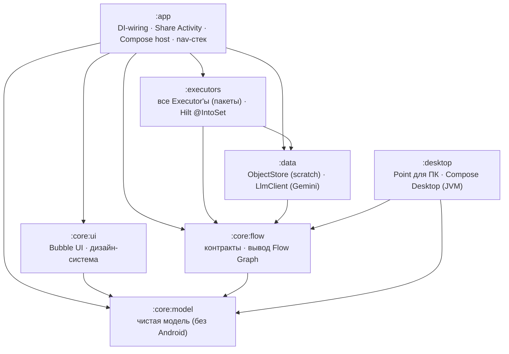
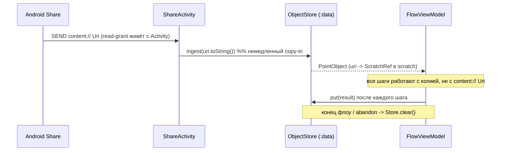

# Point v0.2 — Архитектура

Проектный документ, подготовленный по ТЗ (`../point-v0.2-spec.md`) **до** написания
кода реализации. Здесь — модули, границы, вывод Flow Graph, жизненный цикл
объекта, последовательность экранов и список Executor'ов.

Идея приложения: путешествие по **состояниям объекта**, а не по приложениям. Весь
UI — пузырьки действий вокруг объекта. Никаких списков функций, меню, настроек,
чатов.

---

## Инвариант проекта

> **Point не выполняет действия. Point изменяет объекты в соответствии с намерением
> пользователя.**

Модель: **`Object → Intent → Resolver → Capability → Executor → Object`.**

- **Незаменимы: `Object` · `Intent` · `Flow`.** Пользователь оперирует объектом, выражает
  намерение, движется по потоку — это ядро, которое переживёт любую смену реализации.
- **Заменимы:** `Capability`, `Executor`, `Realizer`, `Resolver`, ICG, локальная и облачная
  модели. Как намерение исполнено — деталь под `Intent`.
- Поэтому завтра локальный OCR можно заменить исполнением через ICG, **и UX Point не
  изменится**: экран привязан к `Intent`, не к механизму.

`Intent` (`:core:model`) — средний член, который видит пользователь (Понять / Подготовить /
Отправить). `Resolver` уже выбирает исполнителя по `RealizerMeta.kind{LOCAL,CLOUD,REMOTE}`
(`REMOTE` зарезервирован под ICG). `ObjectRef` (`:core:model`) — ссылка на объект,
отвязанная от схемы, чтобы объект жил дольше процесса.

---

## Модули и направление зависимостей



**`:desktop`** — вторая витрина того же ядра: Compose Desktop на JVM, переиспользует
`:core:model` и `:core:flow` **без изменений** (ради чего они и держатся Android-free).
Свой ручной DI (без Hilt), свои JVM-реализации `Capability`/`Realizer` (Открыть/
Копировать/Показать в папке/Сохранить/Скачать видео) и LAN-приёмник на `com.sun.net.httpserver`.
Зависит только вниз — на два чистых core-модуля, как и правило требует.

Свою память компьютер держит сам (`Journal.kt`, #407): что приезжало, откуда, когда и какие
возможности к этому применяли — с исходом каждой. Это **не** телефонный `HistoryStore`: тот помнит
объекты, а этот — путь; общий шов поднимется в `:core:flow`, когда тот же путь понадобится
телефону (почему именно так — в `DECISIONS.md`). Хранение — одним файлом `~/.point-pc/journal`
тем же кодеком `k=v`, каким живут `config`, `phone-caps` и очередь на телефон.

**Правило зависимостей (строгое):** стрелки идут только вниз. `:core:model` не
зависит ни от чего; `:core:flow` — только от `:core:model`. Ни один модуль не
зависит от `:app`. Реализации side-effect'ов (`:data`, `:executors`) зависят от
контрактов (`:core:flow`), но не наоборот.

| Модуль | Тип | Android API? | Роль |
|---|---|---|---|
| `:core:model` | kotlin-jvm | **нет** | Модель, состояния, результаты. |
| `:core:flow` | kotlin-jvm | **нет** | Контракты Executor/Registry/Store/Llm, вывод графа. |
| `:core:ui` | android-lib | да (Compose) | Пузырьки, дизайн-система. Ноль бизнес-логики. |
| `:data` | android-lib | да | Scratch-store, copy-in, cleanup; Gemini-клиент. |
| `:executors` | android-lib | да | Все Executor'ы; регистрируются через Hilt multibinding. |
| `:app` | android-app | да | Share Activity, Compose host, стек-навигация, DI-wiring. |
| `:desktop` | kotlin-jvm + compose-desktop | **нет Android** | Point для ПК: окно, LAN-приёмник, свои JVM-действия, ручной DI. Переиспользует `:core:model`+`:core:flow`. |

---

## Capability-слой (разрез v0.3) — «что» отделено от «как»

Центральная абстракция платформы. UI / Flow Graph / Bubble Policy знают только
**Capability** (декларацию), но никогда — реализацию.

```
   UI · FlowGraph · BubblePolicy   ← знают только Capability
                │
        CapabilityRegistry (auto @IntoSet)
                │  Capability{ id, icon, meta{priority,cost,latency,network,auth}, accepts, produces? }
                ▼
             Resolver              ← выбирает реализацию; несколько → фолбэк-цепочка
                ▼
   LocalRealizer · AiRealizer · CloudRealizer · IcgRealizer(завтра)
```

- **`Capability`** — декларация без `execute` (в `:core:flow`). Набор capability,
  чьи `accepts(state)==true`, и есть Flow Graph.
- **`Realizer`** — поведение (`perform`), привязано к `capabilityId`. Одна
  capability может иметь несколько realizer'ов; `Resolver` выбирает. Это точка
  входа для cloud / Internet Capability Graph — UI/граф не меняются.
- **`produces` — подсказка (nullable).** Истинное следующее состояние
  переклассифицируется из реального выходного объекта (закрывает непредсказуемый
  выход AI).
- **`BubblePolicy`** — чистая функция `(state, candidates) → ранжированный список`.
  Сейчас детерминированная сортировка `(priority, id)`; завтра ML/LLM без правок.
- **`CapabilityMeta`** — одни поля для четырёх задач: ранжирование, выбор
  реализации, paywall (Pro-capability), бюджет первого экрана (`network` вне 300 мс).

Каждое из 9 действий = `*Capability` (dep-free) + `*Realizer` (поведение). Тест
реестра поэтому не нуждается в фейках — декларации без зависимостей.

## Flow Graph выводится, а не хранится

Отдельной таблицы переходов нет. Каждый `Executor` декларирует контракт входа
(`accepts(state)`) и выхода (`produces(state)`). Пузырьки для текущего состояния —
это ровно те Executor'ы, у кого `accepts(state) == true`:

```
bubblesFor(state) = registry.executors.filter { it.accepts(state) }.map { it.toBubble() }
```

Добавили Executor → граф расширился. Убрали → сузился. UI и карта переходов не
могут рассинхронизироваться, потому что карты нет.

---

## Состояние объекта = тип + дешёвые признаки

`ObjectState(kind: ObjectKind, features: Set<Feature>)`.

- `kind` — по MIME, мгновенно (нулевые сигналы).
- `features` — дёшево вычисляемые сигналы (`HAS_TEXT`, `IS_IMAGE_PDF`,
  `ZIP_OF_IMAGES`, `HAS_URL`, `LARGE`).

Богатство состояния определяет качество первого экрана: только MIME → пузырьки
generic; есть признаки → пузырьки умные. Признаки добавляются **прогрессивно**
(см. ниже).

---

## Первый экран и латентность

1. **Первая отрисовка ≤ 300 мс** — только по нулевым сигналам (MIME / расширение /
   размер). Никакого I/O. → базовый набор пузырьков.
2. **Async-обогащение** — заглянуть внутрь PDF/ZIP, детект `HAS_TEXT` — идёт в
   фоне и *дополняет*/уточняет пузырьки позже (progressive disclosure). Иначе
   200-МБ ZIP ломает обещание 300 мс.
3. **LLM не на первом экране.** Gemini вызывается только после выбора действия,
   внутри `AiExecutor`.

---

## Жизненный цикл объекта (scratch-store)



**Почему copy-in немедленный:** временный read-grant на `content://` Uri привязан
к жизни принимающей Activity. Наивная передача Uri в корутину/ViewModel падает
при пересоздании Activity. Копия в приватном scratch снимает эту грабли; по
завершении флоу scratch чистится.

---

## Навигация — стек состояний

- Флоу = стек `FlowFrame(state, object, bubbles)` внутри одной ViewModel.
- Compose рендерит **верхний** фрейм.
- Системный Back = pop фрейма; выход из приложения — только при пустом стеке.
- Process death в середине флоу (MVP): флоу теряется, но `ObjectStore.clear()`
  обязателен. Персист стека — за рамками MVP.

---

## Результат Executor'а — явный канал

`sealed ExecutorResult { Success(ResultObject) | Failure(reason, recoverable) | NeedsInput(prompt) }`.

Невидимая цепочка без обработки ошибок — ловушка отладки и доверия (OCR-промах →
мусорный результат, а юзер не видит, где сломалось). Возможность
«заглянуть/повторить шаг» строится на `Failure(recoverable = true)` и `NeedsInput`.

---

## AI Executor (аварийный универсальный)

Пайплайн `AiExecutor.execute`:

1. авто-системный промпт по типу объекта;
2. добавить инфо об объекте;
3. приложить файл (учесть лимиты Gemini: inline data vs Files API по размеру/MIME);
4. дать юзеру дописать запрос (`amendment`);
5. отправить запрос модели;
6. получить результат;
7. **материализовать вывод в `ResultObject`** (v0.1: markdown-ответ → `.md` файл
   в scratch) и вернуть в Flow Graph.

Юзер никогда не видит чата — только новый объект.

---

## Bubble UI (`:core:ui`)

Только отображение: текущий объект (превью) + пузырьки действий. Ноль
бизнес-логики. Пузырёк = `icon + title`, тап → `executorId`. Иконка приходит из
модели ключом (`Bubble.icon`), `:core:ui` резолвит её в вектор.

Последовательность экранов = отрисовка верхнего `FlowFrame`: **[объект + пузырьки]
→ (выбор) → [прогресс/NeedsInput/Failure] → [новый объект + пузырьки] → …**

---

## Executor'ы MVP

| Executor | Вход → выход |
|---|---|
| `ShareExecutor` | любой объект → системный Share |
| `SaveExecutor` | любой объект → хранилище |
| `PdfExecutor` | image/text → PDF; PDF → извлечение текста |
| `ImageExecutor` | image → конвертация/сжатие |
| `ZipExecutor` | распаковка / архивирование |
| `TranslateExecutor` | text/pdf → перевод |
| `OpenUrlExecutor` | url / текст с `HAS_URL` → открыть в браузере |
| `OfficeExecutor` | docx/xlsx/pptx → извлечь текст |
| `AiExecutor` | аварийный, Gemini |

Поддерживаемые типы MVP: `image/*`, `text/plain`, `application/pdf`,
`application/zip`, `text/uri-list`.

---

## Тестирование

Каждый side-effect (file IO, network, Android framework, PDF-рендер) — за
интерфейсом; в unit-тестах подставляются fakes. Pure-модули (`:core:model`,
`:core:flow`, чистая логика каждого Executor'а) тестируются напрямую, без
Robolectric. Это практический выхлоп принципа «max interfaces».

---

## Статус реализации

**Срез 1 — реализован (Share → copy-in → первый экран с пузырьками):**
- `ObjectClassifier` (нулевые сигналы) + `DefaultExecutorRegistry` (вывод графа) —
  чистая логика, покрыта JVM-тестами.
- 7 Executor'ов: реальные `accepts`/`produces` (корректные пузырьки), `execute` —
  честные заглушки `Failure(recoverable)` до среза 2.
- `ScratchObjectStore` — немедленный copy-in, `put`, `clear`.
- `:core:ui` — `FirstScreen`/`BubbleItem`/тема + `@Preview`-ы.
- `:app` — `FlowViewModel` (стек фреймов), `ShareActivity`, `PointHost`; Hilt-граф
  (`@IntoSet` executors, binds store/registry).
- Тест-петля без APK: Compose Preview + debug `SandboxActivity` (`docs/TESTING.md`).

**Срез 2 — реализован (реальные действия, собирается BUILD SUCCESSFUL):**
- `ImageExecutor` — JPEG-сжатие; `PdfExecutor` — image/text→PDF (`PdfDocument`);
  `ZipExecutor` — распаковка с защитой от zip-slip (→ `Done`).
- `ShareExecutor`/`SaveExecutor` — **без Activity**: `Sharer`/`Exporter` контракты,
  реализованы через `@ApplicationContext` (FileProvider + `startActivity(NEW_TASK)`;
  MediaStore Downloads / app-external на API<29). Новый `ExecutorResult.Done`.
- `GeminiLlmClient` — реальный HTTP (`HttpURLConnection` + `org.json`, без SDK),
  файл прикладывается inline (base64) для image/pdf; ответ → `.md` в scratch.
  `AiExecutor` (NeedsInput → ввод amendment → Gemini), `TranslateExecutor` (text→LLM).
- UI: поле ввода amendment (`FirstScreen`), обработка `Done`/`NeedsInput` в VM.
- Контракты за срез: `Executor.icon/title(state)`, `ObjectStore.ingest(mime)` и
  `newScratchFile`, `Sharer`/`Exporter`, `ExecutorResult.Done` (см. `DECISIONS.md`).

**Срез 3 — реализован (progressive disclosure, BUILD SUCCESSFUL):**
- Контракты `Enricher` / `Enrichment` (`:core:flow`); рантаймер `DefaultEnrichment`
  (Hilt multibinding `Set<Enricher>`).
- `TextUrlEnricher` (текст с URL → `HAS_URL`), `ZipImagesEnricher` (архив из
  картинок → `ZIP_OF_IMAGES`) — дешёвый bounded-peek в `:data`.
- Feature-gated `OpenUrlExecutor` — пузырёк «Открыть» **появляется после** async-
  обогащения (для TEXT с `HAS_URL`) или сразу (для `text/uri-list`); открывает
  браузер через `UrlOpener` (app-context, без Activity).
- VM: после первого кадра `enrichInBackground` обновляет состояние верхнего фрейма
  и пересобирает пузырьки in-place (только если объект всё ещё на вершине стека).

**Срез A — реализован (PDF-текст, BUILD SUCCESSFUL):**
- Контракт `PdfTextExtractor` (`:core:flow`), реализация `PdfBoxTextExtractor`
  (`:data`, PdfBox-Android). `PdfExecutor`: PDF→текст (скан без текста →
  `Failure(recoverable)`); `TranslateExecutor`: PDF→извлечь→перевести.
- Цена: PdfBox тянет шрифтовые ресурсы → debug-APK ~15.8 → 24.5 МБ.

**Срез «Офис + архивы» — реализован (BUILD SUCCESSFUL, 20 тестов):**
- Новый `ObjectKind.OFFICE`; классификатор распознаёт docx/xlsx/pptx (+ legacy
  doc/xls/ppt) по mime и расширению (office проверяется до архивов, т.к. OOXML —
  это zip). Архивы расширены: tar/gz/bz2/xz помимо zip.
- `OfficeTextExtractor` (контракт) + `OoxmlOfficeTextExtractor` (`:data`,
  **без зависимостей** — распаковка OOXML + вытяжка текста из XML-частей) →
  `OfficeExecutor` даёт TEXT-объект (→ перевод/PDF/AI). Legacy binary → `Failure`.
- `ArchiveExtractor` (контракт) + `CommonsArchiveExtractor` (Apache Commons
  Compress) → `ZipExecutor` распаковывает zip/tar/gz/bz2/xz.

**Срез «полировка + расширения» — реализован (24 теста):**
- **Детерминированный порядок пузырьков**: `Executor.order` (по умолч. 50, тай-брейк
  по id); `bubblesFor` сортирует по `(order, id)`. AI всегда последним.
- **7z/rar**: 7z через `SevenZFile`+tukaani-xz, rar через junrar; детект по магическим
  байтам. **office→PDF**: `PdfExecutor` принимает OFFICE (извлечь текст → PDF).
- **UI**: своя индиго-палитра (light+dark) вместо baseline M3; пузырьки появляются
  со ступенчатой анимацией (новый пузырёк обогащения «влетает» отдельно); баннер
  сообщения анимируется; `PointHost` кроссфейдит между объектами (по id).
- **Альтернативный ИИ**: `OpenAiLlmClient` (OpenAI-совместимый: OpenAI/OpenRouter/
  локальный) + `FallbackLlmClient` — Gemini → OpenAI, первый успех выигрывает
  (прозрачно чинит 429). Ключ/URL/модель — из `local.properties`.

**Срез «платформа: Capability ≠ Realizer» — реализован (BUILD SUCCESSFUL):**
- `Executor` разрезан на `Capability` (декларация: id/icon/meta/accepts/produces) +
  `Realizer` (поведение, за `Resolver`'ом) + `BubblePolicy` + `CapabilityRegistry`.
  UI/граф зависят только от Capability; cloud/ICG встанут как ещё один Realizer.
- `produces` → nullable-подсказка (истина переклассифицируется из выхода);
  `CapabilityMeta(priority/cost/latency/network/auth)` — seam ранжирования / paywall /
  бюджета первого экрана. Реестр тестируется без фейков (декларации без зависимостей).

**Срез «История + Избранное» — реализован (метрика: минус переключения):**
- `HistoryStore` (контракт) + `FileHistoryStore` (`:data`, JSONL, `@HistoryDir`,
  без Room): копия каждого объекта + журнал. `HomeActivity` — launcher-домашний
  экран с недавним; объект переоткрывается **без повторного шаринга**.
- `FavoritesStore` + провенанс `FlowFrame(viaCapability/viaTitle)`: сохранить
  последовательность capability и применить к новому объекту в один тап (реплей
  через `Resolver`, стоп на `Done/Failure/NeedsInput`).

**Срез «офлайн + Claude» — реализован (37 тестов):**
- Цепочка провайдеров `Gemini → Claude → OpenAI`. `ClaudeLlmClient` — нативный
  Anthropic Messages API (`HttpURLConnection`+`org.json`, без SDK), картинки/PDF
  base64. Модель — `CLAUDE_MODEL` (по умолч. `claude-opus-4-8`).
- **Офлайн-OCR**: `TextRecognizer` (контракт) + `TesseractTextRecognizer` (`:data`,
  tesseract4android / Tesseract 5, модели rus+eng в assets → filesDir). `OcrRealizer`
  пробует устройство первым, облако — фолбэком → развязывает «Распознать текст» от
  Gemini-квоты. ABI ограничен `arm64-v8a`+`armeabi-v7a`.
- **Фото→скан**: чистый `ScanFilter` (grayscale + Otsu, юнит-тест) + `ScanRealizer`
  (тонкая Bitmap-обвязка) → IMAGE (дальше «В PDF»/Save/Share).
- **Табло прибора** (#262): `MeterReader` (контракт) + `TesseractMeterReader` (`:data`) —
  найти табло, вырезать, довернуть, увеличить, читать только цифры. Геометрия и пороги —
  чистый `findMeterDisplays` (`:core:flow`, тесты без устройства). Это **отдельное действие**
  «Прочитать показание» (`MeterOcrCapability`, местное и бесплатное), а не звено цепочки
  «Распознать текст»: поиск табло срабатывает на 22 кадрах корпуса из 23, и внутри цепочки он
  подменял бы облачное чтение документа выдуманным числом (разбор — в `DECISIONS.md`).

**Срез «бренд из Point.dc.html» — реализован (BUILD SUCCESSFUL):**
- Тема ink `#0F1626` + оранжевый `#F5610F` на светлом `#F4F5F7` (вместо индиго M3);
  круглые цветные пузыри (`bubbleColor` на действие), подпись «Следующее действие»,
  экран «Обработка». Launcher-иконка — adaptive-icon вектором из SVG-пути макета
  (ink-градиент + белый пузырь + оранжевая точка; monochrome для тем Android 13+).

**Срез «коллекции: распаковка → объект-набор» — реализован (BUILD SUCCESSFUL):**
- Новый `ObjectKind.COLLECTION`: «Распаковать» больше не терминальна —
  `ArchiveRealizer` отдаёт `Success(ResultObject(COLLECTION, "inode/directory",
  <scratch-dir>))`, флоу продолжается на самой коллекции. `ArchiveExtractor.extract`
  теперь возвращает каталог (`ScratchRef`), а не число файлов.
- Первое коллекционное действие `SaveAll` («Сохранить всё») экспортирует каждый
  файл каталога через `Exporter`; одиночные Share/Save/AI для COLLECTION скрыты
  (`accepts(kind != COLLECTION)`). Классификатор маппит `inode/directory → COLLECTION`
  (kind переживает переклассификацию в `ObjectStore.put`). См. `DECISIONS.md`.

**Срез «Открыть во внешнем приложении» — реализован (BUILD SUCCESSFUL):**
- Контракт `Viewer` (`:core:flow`) + `AndroidViewer` (`:data`) — `ACTION_VIEW` через
  тот же FileProvider, что и Share (scratch уже экспонирован); нет приложения →
  чистый `Failure(recoverable)`. `OpenCapability`/`OpenRealizer` — терминальные, как
  `OpenUrl`; `accepts` = файловые объекты (кроме `URL`/`COLLECTION`), `priority=65`.
- Старое `OpenUrl` переименовано «Открыть» → «Открыть ссылку» (чтобы TEXT c `HAS_URL`
  не дублировал пузырёк). Иконка `open` → `OpenInNew`. См. `DECISIONS.md`.

**Срез «коллекция: просмотр + вход в элементы» — реализован (BUILD SUCCESSFUL):**
- `ObjectStore.children(collection)` (`:core:flow` + `ScratchObjectStore`) — файлы
  scratch-каталога как `PointObject`'ы без копии (mime по расширению через
  `MimeTypeMap`, kind — классификатором). Загрузка async, как `enrichInBackground`;
  результат кладётся в `FlowFrame.items`.
- `FirstScreen` для COLLECTION рисует скроллируемый список содержимого; тап →
  `FlowViewModel.onItem` → `pushFrame(item)` (элемент уже в scratch, без ре-ingest),
  дальше обычный флоу на элементе (Открыть/Сохранить/OCR/…). `Back` возвращает к
  коллекции. Роадмап #2 (Collection-as-Object) — «множественность + UI».
- «Поделиться всем» (`ShareAll` → `Sharer.shareAll` → `ACTION_SEND_MULTIPLE`) —
  вторая коллекционная симметрия к «Сохранить всё»; одиночные Share/Save/Open/AI для
  COLLECTION по-прежнему скрыты.

**Срез «встроенный просмотр текста» — реализован (BUILD SUCCESSFUL):**
- `ObjectStore.readText(obj, limit)` (`:core:flow` + `ScratchObjectStore`) — bounded
  чтение содержимого (100k символов). Грузится async, кладётся в `FlowFrame.textPreview`.
- `FirstScreen` для TEXT рисует прокручиваемую панель с содержимым и родным
  выделением/копированием (`SelectionContainer`) — читается в Point, без внешнего
  приложения. См. `DECISIONS.md`.

**Срез «PDF-страницы как коллекция» — реализован (BUILD SUCCESSFUL):**
- `PdfRasterizer` (контракт) + `PdfRendererRasterizer` (`:data`, нативный
  `PdfRenderer`, JPEG/страница) → `PagesCapability`/`PagesRealizer`: PDF → `COLLECTION`
  страниц (тот же шов, что распаковка архива). Дальше — существующий просмотр
  коллекции (страницы = IMAGE-элементы). Закрывает роадмап #2 и для PDF.

**Срез «paywall-шов (Entitlements)» — реализован (BUILD SUCCESSFUL):**
- `Entitlements` (контракт) + `DefaultEntitlements` (`:data`, всё разрешено). Гейт в
  `DefaultResolver`: PAID-capability без entitlement → `PaywallRealizer` (апселл)
  вместо реального realizer'а — как выбор реализации, UI/граф не трогаем. Роадмап #3;
  включается заменой дефолта на реальную проверку подписки. См. `DECISIONS.md`.

**Срез «обучаемая BubblePolicy» — реализован (BUILD SUCCESSFUL):**
- `CapabilityUsage` (контракт) + `FileCapabilityUsage` (`:data`, `@Singleton`,
  Properties-персист, снимок в памяти) — счётчики применений; VM пишет `record` на
  каждом действии. `LearningBubblePolicy` (`:executors`) сортирует по
  `priority − min(использований, 25)` — часто используемое вперёд, при нуле == старый
  порядок. Биндится вместо `DefaultBubblePolicy` (тот оставлен для тестов). Роадмап #4.

**Срез «Парсинг в Excel» — реализован (BUILD SUCCESSFUL):**
- `SpreadsheetWriter` (контракт) + `OoxmlSpreadsheetWriter` (`:data`, минимальный
  OOXML-zip **без зависимостей**, inline-строки) — пишет строки в `.xlsx`.
- `ExcelCapability`/`ExcelRealizer` (IMAGE/PDF/TEXT → OFFICE, PAID/сеть → Pro под
  paywall): LLM извлекает таблицу как TSV (табы/переносы надёжнее CSV) → парсинг →
  `.xlsx`. Дальше — Открыть/Извлечь текст/Сохранить/Поделиться. См. `DECISIONS.md`.

**Срез «сканер: фоллбек-шов + объединение в PDF» — реализован (BUILD SUCCESSFUL):**
- Фильтр-скан (`ScanRealizer`) помечен фоллбек-тиром (`RealizerMeta priority=90`):
  предпочтительный OpenCV-realizer встанет Capability Pack'ом (первый «DLC»,
  `isAvailable`-гейт, низкий priority), `Resolver` выберет лучший доступный, падая на
  фильтр. `MergePdfCapability` (COLLECTION изображений → один PDF) — «объединить
  страницы» без тяжёлых зависимостей. OpenCV-пак — отдельный сфокусированный шаг
  (+~40 МБ, качество детекции — только на устройстве). См. `DECISIONS.md`.

**Срез «OCR: два реализатора через фолбэк-цепочку» — реализован (BUILD SUCCESSFUL):**
- Пункт #1 роадмапа в проде: device-first/cloud-fallback OCR вынесен из одного
  реализатора в два (`DeviceOcrRealizer` LOCAL `priority=10`, `CloudOcrRealizer` CLOUD
  `priority=90`) одной `OcrCapability`, выбираемых `Resolver`'ом. «Readied» шов
  «несколько Realizer на одну Capability» стал нагруженным.
- `Resolver` обобщён с «выбрать один доступный» до **output-based фолбэк-цепочки**
  (`FallbackRealizer`): каждый реализатор передаёт следующему только на
  `Failure(recoverable=true)`. Устройство распознало пусто → recoverable-Failure →
  облако. Заодно строго улучшает scan-шов (рантайм-сбой OpenCV → фильтр). Capability с
  одним реализатором — напрямую, без обёртки. Интеграционный `OcrChainTest`. См.
  `DECISIONS.md`.

**Большая автономная сессия — «правая кнопка для всего» + трансформеры + фон (много срезов, все на CI-зелёном, проверены на эмуляторе):**
- **Триггеры/вход**: `ACTION_PROCESS_TEXT` (выделил текст в любом приложении → Point),
  чтение буфера при открытии (`onWindowFocusChanged`, Android 10+), device-app-picker
  inline (`AppLauncher.queryIntentActivities`), синтез совместимости через одну
  трансформу (`AppTarget.via`, #79.1).
- **Сущности → действия** (`EntityExtractor` ML Kit, модель по скрипту RU/EN): Позвонить/
  Сообщение/Написать письмо, Открыть на карте (`geo:`), Создать событие
  (`CalendarInserter`), Скопировать карту; vCard → «Добавить в контакты» (`Viewer`),
  «Собрать данные» (все сущности → список), «Скопировать» (`Clipboard`).
- **Трансформеры (#85)**: text/url → **QR** (ZXing), image → **Считать QR** (обратно, через
  `QrEnricher`/`HAS_QR`); фичи `HAS_ADDRESS/DATE/CARD/QR/VCARD`.
- **Фон (ML Kit Subject Segmentation)**: «Убрать фон» (→ прозрачный PNG), «Размыть фон»
  (портретный эффект), «Заменить фон» (пикер второй картинки через
  `rememberLauncherForActivityResult` + `ActionResult.NeedsImage`); общий `ImageCompositor`.
- **Документы**: PDF/текст → **Word** (`.docx`, hand-rolled OOXML, #61).
- **UX-швы**: **Preview** перед действием (`Realizer.preview` → лист-подтверждение, #97),
  **Negotiation** «почти доступно» (`Capability.missing` → latent-пузырьки, #97), **3 AI-
  промпта** чипами (`NeedsInput.suggestions`, #86), markdown-рендер AI-ответов,
  EXIF-разворот перед OCR (корень «мусора»), «Распознать в облаке», авто-язык перевода.
- **Бренд**: шрифты Manrope (текст) + Unbounded (дисплей) через `FontVariation` (#13).

**Отложено:** OpenCV-скан-пак (авто-геометрия), `IS_IMAGE_PDF`/`HAS_TEXT`-энричер для PDF,
персист стека на process death; составной «набор» объектов (#96) и семантические фичи
`IS_MEETING/…` (#89) — под дизайн; выравнивание нативных либ по 16 КБ для релиза (#68).

**Срез «прогрессивное обогащение с ценами + скриншот оживает» (#64) — реализован (BUILD SUCCESSFUL):**
- `EnricherMeta(cost INSTANT/FAST/SLOW, mayYield, label)`; `Enrichment` → `Flow<EnrichmentUpdate>`.
  `DefaultEnrichment` = планировщик: волны по цене, параллельно внутри волны, emit на каждое
  завершение; SLOW — только если `mayYield` открывает новые действия (гейт через
  `CapabilityRegistry` на состоянии, обогащённом дешёвыми волнами).
- `OcrEnricher` (SLOW, «Распознаю текст…»): скриншот → Tesseract → сущности → `HAS_*` прямо на
  IMAGE; текст — sidecar в `metadata[META_OCR_TEXT_REF]`. Entity-реализаторы читают sidecar
  (`entitySourceText`), `DeviceOcrRealizer` отдаёт его как кэш, `ExtractAll` отвязан от TEXT.
- `FlowViewModel` применяет апдейты к фрейму **по id** (поздние находки доезжают в нижние фреймы),
  `FlowFrame.enriching` → индикатор фоновой работы на экране. `looksLikeOcrGarbage` → :core:flow.
- Проверено: ML Kit OCR **без кириллицы** — Tesseract остаётся базой (см. DECISIONS).

**Срез «первый экран = Point понял» (#114, срез 1) — реализован (BUILD SUCCESSFUL):**
- Карточка понимания под объектом: `understoodFacts(obj)` (:core:ui, JVM-тест) — факты со
  значениями из `metadata[entity.*]` (энричеры сохраняют первое значение каждого типа сущности;
  карта маскируется «•• 5678»); running-метки #64 — внутри карточки (один «монолог» Point).
- Действия: топ-3 «Самые вероятные» (порядок — `LearningBubblePolicy`), остальное — «Все
  действия (N)» группами по уровням. `Bubble.tier INSTANT/SMART/AI` выводится из
  `CapabilityMeta` в реестре; AI-пузырь — tertiary-кольцо.
- Intent-first UI снят (контракты `intents()`/`intentsFor` остаются); `:core:ui` →
  `:core:flow` (разрешено правилом модулей). Превью-харнесс обновлён под новую композицию.

**Срез «семантический уровень понимания» (#87, #89) — реализован:**
- Над синтаксическими `entity.*` — `semantic.type` (закрытый белый список
  meeting/purchase/recipe/job → `Feature.IS_*`) и `semantic.summary`. Пишет «Понять
  глубже» тем же строгим строчным контрактом (`Semantics.kt` в `:core:flow`);
  `MetadataEntityEnricher` зажигает `IS_*` мгновенно из metadata (переживает history и
  переезд на ПК). Карточка ведёт семантикой («Это рецепт · …»). Действия от типа:
  «Список покупок» (IS_RECIPE), «Создать событие» += IS_MEETING, «Отклик» (IS_JOB).

**Срез «Point для ПК» (#147) — реализован (E2E эмулятор↔Windows):**
- Новый модуль `:desktop` (Compose Desktop, JVM) — окно, drag&drop, свои действия.
- Протокол `ContinueOnPc` (`:core:flow`, pure): `PcPairing`/`qrPayload`/`parsePcPairing`,
  `encodePcMeta`/`decodePcMeta` — понимание едет метадатой вместе с объектом.
- LAN на `com.sun.net.httpserver` (ноль зависимостей): `/pair` (диалог-подтверждение на
  ПК → долгоживущий токен), `/receive` (constant-time токен, base64-заголовки, стрим в
  inbox), `/ping`. Телефон: пузырь «На компьютер» (`PcCapability`/`PcRealizer`,
  `HttpUrlPcTransport`), экран пейринга, mDNS-автообнаружение (jmdns↔NsdManager).
- Поставка: msi/exe/portable (jpackage поверх Temurin; `modules("jdk.httpserver")`).

**Срез «действия ПК как пузыри телефона» (#80) — реализован (Distributed Capability Graph по LAN):**
- ПК объявляет свои действия (`GET /caps`, `id=label[<TAB>KIND]` строки, токен-гейт);
  телефон кэширует при пейринге (`FilePcCaps`) и синтезирует пары Capability/Realizer при
  старте (как app-пузыри #66). Тап → `/receive` + `X-Point-Action` → ПК исполняет realizer.
  «Скачать видео на ПК» (yt-dlp) и «Напечатать на ПК» — kind-гейт (URL) и гейт железа.
- #316: «умею, но не сейчас» объявляется с причиной — строка `=id=label<TAB>KINDS<TAB>причина`
  (ведущий `=` старый декодер роняет сам, поэтому старый телефон не ломается). Кнопкой такое
  не становится: уходит в «Почти доступно» (`Capability.missing`, #97), реализатор отказывает
  до отправки, сервер ПК не исполняет недоступное даже по прямому `X-Point-Action`.

**Срез «Liquid Software: объект и намерение в обе стороны» (#161) — реализован (E2E):**
- ПК→телефон pull: ПК держит `Outbox` (`<n>.bin`+`<n>.meta`), маршруты
  `/outbox` | `/outbox/file` | `/outbox/ack`; телефон тихо забирает в `loadRecent`
  (троттл 30с) → плашка «С компьютера: N» → download→ingest→ack (at-least-once).
  `PulledFileFactory`-шов держит `FlowViewModel` JVM-тестируемым.
- Намерение обратно: телефон объявляет свои действия (`POST /phone-caps`), ПК рисует
  «Позвонить · телефон» / «Создать событие · телефон» (kind-гейт), тап кладёт объект с
  `pc.action`; телефон при заборе исполняет действие сразу после ingest (`onShared(autoAction)`).

**Срез «Progressive Object: корзина» (#96) — реализован (E2E):**
- Пузырь «В корзину» (терминал) копит объекты в `basket/` (переживает флоу); Home-плашка
  «Корзина: N» → существующий `ingestMultiple` → обычный COLLECTION-флоу («Набор (N)»).
  Ноль новой механики коллекций.

**Срез «плюс-вариант: AI-двойник» (#128) — реализован (E2E):**
- Паттерн: `<id>-plus`, label «<Label>+», те же accepts, PAID/network — рядом с локальным
  собратом в «AI и облако», только там где ИИ объективно добавляет. «В Word+» (LLM
  размечает документ строгим контрактом T=/H=/B=/P= → styled OOXML `DocxWriter.writeStyled`);
  «Собрать данные+» (LLM собирает NAME/ORG/AMOUNT/DATE — то, что ML Kit-регекс не видит).

**Срез «поиск по документу» (#279) — реализован:**
- `findOnPage` (`:core:flow`, чистый) — где на странице лежит запрос человека. Обещание одно:
  напечатанное на странице находится, если его набрать. Свёртка своя и **посимвольная**
  (`foldForSearch`): регистр/пробелы/кавычки не различие, разрядный пробел в числе — оформление,
  пропавшая запятая — другое число. Целостная свёртка свода (`normConsensus`) сюда не годится —
  она судит токен целиком, а поиск ищет кусок внутри строки, склеенной из атомов движка; замер на
  корпусе и разбор — в `DECISIONS.md`. Никакого нечёткого поиска; ищется в пределах строки
  (`AtomLayer.lines`), находка — набор атомов и рамка, тот же адрес, что у выделения (#259) и у
  ответа модели.
- `FindCapability`/`FindRealizer` + новый признак `Feature.HAS_WORD_LAYER` (зажигает `OcrEnricher`
  вместе со слоем, восстанавливает из метаданных `MetadataEntityEnricher`): нет слоя слов —
  действия нет. У PDF — `missing` «разложите на страницы»: второго пути к пикселям не заводим,
  страницы уже растрируются «Страницами».
- `FindScreen` (`:core:ui`) — страница и подсветка найденных мест; геометрия общая с экраном
  выделения (`PageCanvas`: `pageFit`/`drawPageHighlights`). Тап по пузырю перехватывает host
  (как чат и «Открыть в…»), `FindRealizer` отвечает тем же счётом без экрана.

